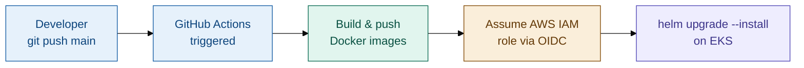
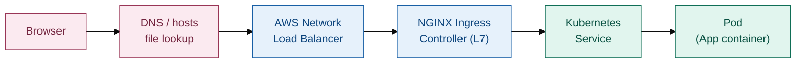

# Weather & AQI Dashboard — 3-Tier Application on AWS EKS

A 3-tier weather and air quality dashboard, containerized with Docker, deployed on **Amazon EKS** using **Helm**, exposed through an **NGINX Ingress Controller** behind an **AWS Network Load Balancer (NLB)**, with a fully automated **CI/CD pipeline** on GitHub Actions.

---

## Architecture overview

**CI/CD flow — what happens on every push to `main`**



**Runtime traffic flow — how a user actually reaches the app**



The NLB is the single external entry point for all traffic (Layer 4). The NGINX Ingress Controller sits behind it and does the actual host/path-based routing (Layer 7), deciding which Kubernetes Service — frontend, weather-service, or aqi-service — a request should go to.

---

## Tech stack

| Layer | Technology |
|---|---|
| Frontend | React (served as a containerized app) |
| Backend services | Weather Service, AQI Service (independent microservices) |
| Containerization | Docker |
| Container registry | Docker Hub |
| Orchestration | Amazon EKS (Kubernetes) |
| Package management | Helm |
| Ingress / load balancing | NGINX Ingress Controller + AWS Network Load Balancer |
| CI/CD | GitHub Actions |
| Cloud auth | AWS IAM Role with OIDC (no long-lived access keys) |

---

## Repository structure

```
3-TIER/
├── .github/workflows/          # GitHub Actions CI/CD pipeline
├── frontend/                   # React frontend app + Dockerfile
├── services/
│   ├── weather-service/        # Weather microservice + Dockerfile
│   └── aqi-service/            # AQI microservice + Dockerfile
├── helm/
│   └── weather-aqi-dashboard/  # Helm chart (root)
│       ├── Chart.yaml
│       ├── deployment.values.yaml
│       ├── env.values.yaml
│       └── templates/          # K8s manifests (deployments, services, ingress, etc.)
├── docker-compose.yml          # Local development (without Kubernetes)
└── README.md
```

---

## Prerequisites

Before deploying, make sure you have:

- An AWS account with an **EKS cluster** already created
- `kubectl`, `helm`, and `aws-cli` installed locally (for manual verification/debugging)
- A **Docker Hub** account
- **NGINX Ingress Controller** installed on the cluster (via Helm repo)
  ```bash
  helm repo add ingress-nginx https://kubernetes.github.io/ingress-nginx
 helm install aqi-nginx ingress-nginx/ingress-nginx \
  --namespace nginx-ingress \
  --create-namespace \
  --set controller.service.type=LoadBalancer \
  --set controller.service.externalTrafficPolicy=Cluster \
  --set controller.service.annotations."service\.beta\.kubernetes\.io/aws-load-balancer-type"="nlb" \
  --set controller.service.annotations."service\.beta\.kubernetes\.io/aws-load-balancer-backend-protocol"="tcp" \
  --set controller.service.annotations."service\.beta\.kubernetes\.io/aws-load-balancer-cross-zone-load-balancing-enabled"="true"
  ```
  This provisions an **AWS Network Load Balancer (NLB)** automatically, which becomes the single entry point for all external traffic into the cluster.

---

## Authentication setup — two separate layers

EKS access requires **two independent authorization checks**, both of which must be configured correctly:

### 1. AWS IAM layer — "can this identity call AWS APIs?"

Instead of static AWS access keys in GitHub Secrets, this project uses **GitHub's OIDC provider** to let Actions assume an IAM role directly — short-lived, more secure, and no rotating secrets.

**Steps:**
1. Add GitHub as an OIDC Identity Provider in AWS IAM (`IAM → Identity providers`), issuer URL: `https://token.actions.githubusercontent.com`.

   Or via AWS CLI:
   ```bash
   aws iam create-open-id-connect-provider \
     --url https://token.actions.githubusercontent.com \
     --client-id-list sts.amazonaws.com \
     --thumbprint-list 6938fd4d98bab03faadb97b34396831e3780aea1
   ```
   Verify it was created:
   ```bash
   aws iam list-open-id-connect-providers
   ```
   > Only one GitHub OIDC provider can exist per AWS account. If you get `EntityAlreadyExists`, it's already set up — move on to creating the role.

2. Create an IAM Role (e.g. `github-action-eks-role`) with this trust policy, scoped to your repo and branch:
   ```json
   {
     "Version": "2012-10-17",
     "Statement": [{
       "Effect": "Allow",
       "Principal": {
         "Federated": "arn:aws:iam::<ACCOUNT_ID>:oidc-provider/token.actions.githubusercontent.com"
       },
       "Action": "sts:AssumeRoleWithWebIdentity",
       "Condition": {
         "StringEquals": { "token.actions.githubusercontent.com:aud": "sts.amazonaws.com" },
         "StringLike": { "token.actions.githubusercontent.com:sub": "repo:<org>/<repo>:ref:refs/heads/main" }
       }
     }]
   }
   ```
3. Attach a permissions policy granting at least:
   ```json
   {
     "Effect": "Allow",
     "Action": ["eks:DescribeCluster", "eks:ListClusters"],
     "Resource": "arn:aws:eks:*:<ACCOUNT_ID>:cluster/<cluster-name>"
   }
   ```
4. In the workflow, grant the job permission to request an OIDC token and assume the role:
   ```yaml
   permissions:
     id-token: write
     contents: read

   - uses: aws-actions/configure-aws-credentials@v4
     with:
       role-to-assume: ${{ secrets.AWS_ROLE_ARN }}
       aws-region: ${{ secrets.AWS_REGION }}
   ```

### 2. Kubernetes RBAC layer — "can this identity run kubectl/helm inside the cluster?"

Being allowed to call `DescribeCluster` does **not** automatically grant permission to manage pods, deployments, or services inside the cluster. The IAM role must also be mapped inside Kubernetes itself, via the `aws-auth` ConfigMap:

```bash
kubectl edit configmap aws-auth -n kube-system
```

```yaml
data:
  mapRoles: |
    - rolearn: arn:aws:iam::<ACCOUNT_ID>:role/github-action-eks-role
      groups:
        - system:masters
      username: github-actions
```

> Both layers must reference the **exact same IAM Role ARN** — a mismatch here is one of the most common causes of "cluster unreachable" errors.

---

## GitHub Secrets required

| Secret | Purpose |
|---|---|
| `DOCKERHUB_USERNAME` | Docker Hub login |
| `DOCKERHUB_TOKEN` | Docker Hub access token (not your account password) |
| `AWS_REGION` | Region of the EKS cluster |
| `EKS_CLUSTER_NAME` | Exact name of the EKS cluster |
| `AWS_ROLE_ARN` | ARN of the IAM role Actions will assume via OIDC |

All secrets must be added as **Repository secrets** (Settings → Secrets and variables → Actions), not Environment secrets — unless the job explicitly declares `environment:`.

---

## CI/CD pipeline

The workflow (`.github/workflows/main.yaml`) runs on every push to `main`, in two sequential jobs:

**Job 1 — Build & Push**
- Logs in to Docker Hub
- Builds and pushes three images (frontend, weather-service, aqi-service), tagged with both the commit SHA and `latest`

**Job 2 — Deploy** (runs only after Job 1 succeeds)
- Assumes the AWS IAM role via OIDC
- Updates local kubeconfig to point at the EKS cluster
- Runs `helm upgrade --install` against the chart, passing the new image tags
- Verifies rollout status and pod health

---

## Accessing the application

The Ingress resource routes traffic based on a **hostname**, configured via `ingress.host` in the Helm values:

```yaml
ingress:
  enabled: true
  className: nginx
  host: weather-dashboard.example.com
```

### If you own a real domain

Point a DNS **CNAME** record for your domain/subdomain at the NLB's hostname (find it with `kubectl get ingress`), then update `ingress.host` in the values file to match your domain. The app will be reachable directly at that URL — no extra steps needed.

### If you don't have a domain (local/demo access)

You can simulate DNS resolution locally by editing your machine's hosts file:

1. Get the load balancer's IP:
   ```bash
   nslookup <nlb-hostname-from-kubectl-get-ingress>
   ```
2. Add an entry to your hosts file, mapping that IP to the ingress hostname:
   - **Windows**: `C:\Windows\System32\drivers\etc\hosts`
   - **macOS/Linux**: `/etc/hosts`
   ```
   <NLB_IP>   weather-dashboard.example.com
   ```
3. Visit `http://weather-dashboard.example.com` in your browser.

> Note: NLB IPs can change over time — this hosts-file approach is for local testing/demo only, not production.

---

## Verifying the deployment

```bash
kubectl get pods -n default        # all pods should be Running / 1/1
kubectl get svc -n default         # check service types and ports
kubectl get ingress -n default     # check the ADDRESS (NLB hostname) assigned
kubectl logs <pod-name> -n default # debug a specific pod
```

---

## Key design decisions

- **OIDC over static AWS keys** — short-lived credentials, no secrets to rotate or leak.
- **Two-layer auth model** — AWS IAM controls API-level access; Kubernetes RBAC (`aws-auth`) controls in-cluster access. Both must be kept in sync.
- **NLB + NGINX Ingress** — a single, stable Layer 4 load balancer in front of an Ingress Controller that handles Layer 7 routing (host/path rules), rather than provisioning a separate load balancer per service.
- **Helm for deployments** — templated, versioned, repeatable releases instead of raw `kubectl apply`.
