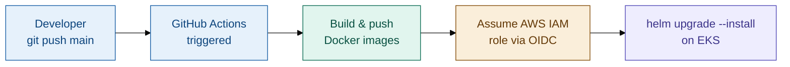
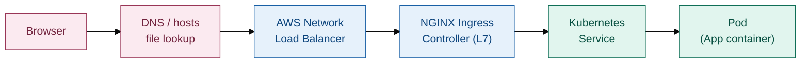

# Weather & AQI Dashboard — 3-Tier Application on AWS EKS

A weather and air quality monitoring dashboard built as three separate services (frontend, weather service, AQI service), containerized with Docker, and deployed to a production-style setup on **Amazon EKS** using **Helm**, **NGINX Ingress**, and a fully automated **CI/CD pipeline** on GitHub Actions.

This document explains the project in the order it was actually built — what was set up first, what came next, and why each piece exists.

---

## 1. What this project does

The app has three parts:

- **Frontend** — a web UI that shows weather and air quality information
- **Weather service** — a backend API that serves weather data
- **AQI service** — a backend API that serves air quality data

Each part is its own Docker container, its own Kubernetes deployment, and gets built and deployed independently through the same pipeline.

---

## 2. Tech stack

| Layer | Technology | Why it's used |
|---|---|---|
| Frontend | React app, containerized | Simple to package and deploy the same way as the backend services |
| Backend | Weather service, AQI service | Kept as separate microservices so each can scale or fail independently |
| Container registry | Docker Hub | Public, free, simple to integrate with GitHub Actions |
| Orchestration | Amazon EKS | Managed Kubernetes, so we don't run our own control plane |
| Package manager | Helm | Lets us template and version the whole set of Kubernetes manifests as one release, instead of applying raw YAML files by hand |
| Ingress | NGINX Ingress Controller | Routes external traffic to the right service based on hostname/path |
| Load balancer | AWS Network Load Balancer (NLB) | Created automatically by the ingress controller; it's the single entry point from the internet into the cluster |
| CI/CD | GitHub Actions | Automates build, push, and deploy on every push to `main` |
| Cloud authentication | AWS IAM Role + OIDC | GitHub Actions authenticates to AWS without storing any long-lived AWS access keys |

---

## 3. Architecture

**CI/CD flow — what happens on every push to `main`**



**Runtime traffic flow — how a user reaches the app**



The NLB is the only entry point for traffic from the internet (Layer 4 — just forwards packets). The NGINX Ingress Controller sits behind it and does the actual routing decision (Layer 7 — looks at the request's hostname and path to decide which Kubernetes Service it should go to: frontend, weather-service, or aqi-service).

---

## 4. Infrastructure components

| Component | Role in the architecture |
|---|---|
| **VPC, subnets, node group** (created by `eksctl`) | The underlying network and compute the cluster runs on — EC2 worker nodes that pods actually run on |
| **EKS control plane** | Fully managed by AWS; schedules pods, tracks cluster state, exposes the Kubernetes API |
| **Node IAM role** (auto-created by `eksctl`) | Lets worker nodes register themselves with the cluster; mapped in `aws-auth` as `system:bootstrappers` / `system:nodes` |
| **GitHub Actions IAM role** (`github-action-eks-role`) | A separate, external identity used only by the CI/CD pipeline to reach the cluster from outside — kept distinct from the node role for least-privilege access |
| **`aws-auth` ConfigMap** | The bridge between AWS IAM identities and Kubernetes RBAC — without an entry here, an IAM identity has no permissions inside the cluster, no matter what AWS-side permissions it has |
| **NGINX Ingress Controller** | Runs as a pod inside the cluster; handles Layer 7 routing (hostname/path-based) for all incoming requests |
| **AWS Network Load Balancer** | Provisioned automatically the moment the ingress controller is installed; the single internet-facing entry point in front of the whole cluster |
| **Helm releases** | The deployable unit — one `helm upgrade --install` brings up or updates all three services' Deployments, Services, and the shared Ingress together, as one versioned release |

---

## 5. Repository structure

```
3-TIER/
├── .github/workflows/          # GitHub Actions CI/CD pipeline
├── frontend/                   # React frontend app + Dockerfile
├── services/
│   ├── weather-service/        # Weather microservice + Dockerfile
│   └── aqi-service/            # AQI microservice + Dockerfile
├── helm/
│   └── weather-aqi-dashboard/  # Helm chart (root)
│       ├── Chart.yaml
│       ├── deployment.values.yaml
│       ├── env.values.yaml
│       └── templates/          # K8s manifests (deployments, services, ingress, etc.)
├── docker-compose.yml          # Local development (without Kubernetes)
└── README.md
```

---

## 6. How this was built — step by step

### Step 1: Package each service as its own container

The app was split into three independently deployable units — frontend, weather service, AQI service — each packaged as its own Docker image. This separation means each piece can be built, versioned, scaled, and released on its own, instead of the whole app moving as one monolithic unit.

### Step 2: Create the EKS cluster with eksctl

The cluster itself (`weather-cluster`) was created using `eksctl`, which handles the VPC, subnets, node group, and node IAM role in one command instead of setting each of those up manually:

```bash
eksctl create cluster \
  --name weather-cluster \
  --region ap-south-1 \
  --nodegroup-name weather-cluster-nodegroup \
  --node-type t3.medium \
  --nodes 2 \
  --nodes-min 1 \
  --nodes-max 3 \
  --managed
```

This one command provisions the whole cluster infrastructure, including a managed node group, and automatically creates a **node IAM role** (something like `eksctl-weather-cluster-nodegroup-...-NodeInstanceRole-...`) which gets mapped in `aws-auth` so the worker nodes themselves can join the cluster — this is separate from the GitHub Actions deploy role set up in Step 6.

Once it finishes (this takes 10–15 minutes), point `kubectl` at the new cluster:

```bash
aws eks update-kubeconfig --region ap-south-1 --name weather-cluster
kubectl get nodes
```

`kubectl get nodes` should list the worker nodes in `Ready` state, confirming the cluster is up before moving on.

### Step 3: Install the NGINX Ingress Controller

With the cluster running, an ingress controller was installed inside it:

```bash
helm repo add ingress-nginx https://kubernetes.github.io/ingress-nginx
helm install ingress-nginx ingress-nginx/ingress-nginx -n ingress-nginx --create-namespace
```

Installing this automatically provisions an **AWS Network Load Balancer**, which becomes the single public entry point for the whole app.

### Step 4: Write the Helm chart

A Helm chart was created at `helm/weather-aqi-dashboard/`, containing:
- `Chart.yaml` — chart metadata
- `deployment.values.yaml` and `env.values.yaml` — configurable values (image names, tags, ports, ingress host, etc.)
- `templates/` — the actual Kubernetes manifests (Deployments, Services, Ingress, ServiceAccount) written using Helm templating so values can be injected at deploy time

Using Helm instead of plain `kubectl apply` means every deployment is versioned, repeatable, and can be rolled back with a single command. The ingress template also carries a few NGINX tuning annotations (request size limit, read/send timeouts) so the proxy layer behaves correctly for the app's traffic patterns.

### Step 5: Set up Docker Hub credentials

A Docker Hub account and access token were created, so GitHub Actions could push built images there. The token (not the account password) is stored as a GitHub secret.

### Step 6: Set up AWS authentication for GitHub Actions — without storing AWS keys

Instead of putting static AWS access keys into GitHub Secrets (which would need to be rotated and are a security risk if leaked), this project uses **OpenID Connect (OIDC)**. GitHub Actions requests a short-lived identity token, and AWS trusts it directly.

**5a. Register GitHub as an OIDC identity provider in AWS IAM**

Console: `IAM → Identity providers → Add provider`, issuer URL `https://token.actions.githubusercontent.com`.

Or via AWS CLI:
```bash
aws iam create-open-id-connect-provider \
  --url https://token.actions.githubusercontent.com \
  --client-id-list sts.amazonaws.com \
  --thumbprint-list 6938fd4d98bab03faadb97b34396831e3780aea1
```
Verify it exists:
```bash
aws iam list-open-id-connect-providers
```
> Only one GitHub OIDC provider can exist per AWS account. If the command returns `EntityAlreadyExists`, it's already set up — move to the next step.

**5b. Create an IAM role that GitHub Actions can assume**

The role's trust policy restricts *which* repository and branch is allowed to assume it — this is important, otherwise any GitHub repository could potentially assume the role:

```json
{
  "Version": "2012-10-17",
  "Statement": [{
    "Effect": "Allow",
    "Principal": {
      "Federated": "arn:aws:iam::<ACCOUNT_ID>:oidc-provider/token.actions.githubusercontent.com"
    },
    "Action": "sts:AssumeRoleWithWebIdentity",
    "Condition": {
      "StringEquals": { "token.actions.githubusercontent.com:aud": "sts.amazonaws.com" },
      "StringLike": { "token.actions.githubusercontent.com:sub": "repo:<org>/<repo>:ref:refs/heads/main" }
    }
  }]
}
```

**5c. Attach a permissions policy to the role**

A common mistake here is attaching the AWS-managed **`AmazonEKSClusterPolicy`** — that policy is actually meant for the **EKS control plane's own internal service role**, not for an external identity (like a CI/CD pipeline) calling into the cluster from outside. It does not grant permission to describe or connect to a cluster from the outside.

Instead, a small custom inline policy was attached:

```json
{
  "Version": "2012-10-17",
  "Statement": [{
    "Effect": "Allow",
    "Action": [
      "eks:DescribeCluster",
      "eks:ListClusters",
      "eks:AccessKubernetesApi"
    ],
    "Resource": "arn:aws:eks:*:<ACCOUNT_ID>:cluster/<cluster-name>"
  }]
}
```

| Permission | Purpose |
|---|---|
| `eks:DescribeCluster` | Lets `aws eks update-kubeconfig` fetch the cluster's API endpoint and certificate, so `kubectl`/`helm` know how to reach it |
| `eks:ListClusters` | Allows listing clusters in the account/region — useful for validation and tooling |
| `eks:AccessKubernetesApi` | Needed for the modern EKS Access Entries authentication path; harmless to include even when using the classic `aws-auth` ConfigMap approach below |

### Step 7: Map the IAM role inside Kubernetes — the second layer of access control

Being allowed to call AWS APIs (Step 5) does **not** automatically mean the role can run `kubectl` or `helm` commands inside the cluster. EKS has a second, completely separate authorization layer: Kubernetes' own RBAC system. The IAM role has to be explicitly mapped to a Kubernetes identity via the `aws-auth` ConfigMap:

```bash
kubectl edit configmap aws-auth -n kube-system
```

```yaml
data:
  mapRoles: |
    - rolearn: arn:aws:iam::<ACCOUNT_ID>:role/github-action-eks-role
      groups:
        - system:masters
      username: github-actions
```

> Both Step 5 and Step 6 must reference the exact same IAM role ARN. A mismatch between the two is one of the most common reasons an otherwise-correct pipeline still can't reach the cluster.

### Step 8: Add secrets to the GitHub repository

Under **Settings → Secrets and variables → Actions → Repository secrets** (not Environment secrets, unless the workflow job explicitly declares `environment:`):

| Secret | Purpose |
|---|---|
| `DOCKERHUB_USERNAME` | Docker Hub login |
| `DOCKERHUB_TOKEN` | Docker Hub access token |
| `AWS_REGION` | Region the EKS cluster runs in |
| `EKS_CLUSTER_NAME` | Exact name of the EKS cluster |
| `AWS_ROLE_ARN` | ARN of the IAM role Actions assumes via OIDC |

### Step 9: Write the GitHub Actions workflow

The workflow (`.github/workflows/main.yaml`) runs on every push to `main`, as two jobs:

**Job 1 — Build & Push**
- Logs in to Docker Hub
- Builds and pushes three images (frontend, weather-service, aqi-service), each tagged with the Git commit SHA and `latest`

**Job 2 — Deploy** (only runs after Job 1 succeeds, via `needs: build-and-push`)
- Requests an OIDC token and assumes the AWS IAM role (`permissions: id-token: write` is required for this)
- Updates the local kubeconfig to point at the EKS cluster
- Runs `helm upgrade --install`, passing in the freshly built image tags
- Checks that the new pods actually came up healthy

**Why the deployment is checked after `helm upgrade`**

`helm upgrade --install` returning successfully only means Kubernetes *accepted* the new configuration — it doesn't guarantee the new pods are actually working. A pod could still fail to pull its image or crash on startup. To catch that immediately instead of finding out later:

```yaml
kubectl rollout status deployment -n ${{ env.HELM_NAMESPACE }} --timeout=3m
```

This command waits for the new pods to become `Running` and `Ready`, and **fails the whole pipeline** if they don't within the timeout — turning a silent bad deploy into a clear red X in GitHub Actions. The following `kubectl get pods` step is just for visibility, printing pod status directly into the workflow logs for quick debugging.

### Step 10: Run the pipeline

Pushing to `main` (or manually triggering via `workflow_dispatch`) runs the full sequence: build → push → assume role → update kubeconfig → Helm deploy → health check.

### Step 11: Access the application

The Ingress routes traffic based on a hostname, set in the Helm values:

```yaml
ingress:
  enabled: true
  className: nginx
  host: weather-dashboard.example.com
```

**If a real domain is available:** point a DNS CNAME record for the domain/subdomain at the NLB's hostname (find it with `kubectl get ingress`), then set `ingress.host` to that domain. The app becomes reachable directly at that URL.

**If no domain is available (local/demo access):** the hostname can be resolved locally instead, using the machine's hosts file:

1. Find the load balancer's IP:
   ```bash
   nslookup <nlb-hostname-from-kubectl-get-ingress>
   ```
2. Add an entry mapping that IP to the ingress hostname:
   - Windows: `C:\Windows\System32\drivers\etc\hosts`
   - macOS/Linux: `/etc/hosts`
   ```
   <NLB_IP>   weather-dashboard.example.com
   ```
3. Visit `http://weather-dashboard.example.com` in the browser.

> Note: an NLB's IP can change over time, so this is meant for local testing/demos only, not for production use.

---

## 7. Verifying the deployment manually

```bash
kubectl get pods -n default        # all pods should show Running and 1/1 ready
kubectl get svc -n default         # check service types and ports
kubectl get ingress -n default     # check the ADDRESS (NLB hostname) assigned
kubectl logs <pod-name> -n default # inspect logs for a specific pod
```

---

## 8. Key design decisions

- **OIDC instead of static AWS keys** — short-lived credentials requested per workflow run, nothing to leak or rotate.
- **Two separate authorization layers for EKS** — AWS IAM controls whether a role can call the EKS API at all; Kubernetes RBAC (`aws-auth`) controls whether that same role can manage resources inside the cluster. Both need to be configured, and both need to agree on the exact same role ARN.
- **NLB + NGINX Ingress, not one load balancer per service** — a single Layer 4 load balancer handles all incoming traffic, and the Ingress Controller does Layer 7 routing behind it, which is cheaper and easier to manage than provisioning a separate load balancer for every service.
- **Helm over raw `kubectl apply`** — deployments are templated, versioned, and repeatable, and a bad release can be rolled back with `helm rollback`.
- **A post-deploy health check (`kubectl rollout status`)** — makes sure the pipeline fails loudly if the new pods don't come up healthy, instead of reporting success on a broken deployment.

---

## 9. Future improvements and production readiness

This setup is functional and demonstrates a complete, working CI/CD-to-Kubernetes pipeline, but a few areas would need to be addressed before this qualifies as production-grade infrastructure:

| Area | Current state | Recommended improvement | Why it matters |
|---|---|---|---|
| **Container registry** | Docker Hub | Migrate to **Amazon ECR** | ECR integrates natively with IAM (no separate registry credentials needed), keeps images in the same account/region as the cluster, supports private repositories by default, and avoids Docker Hub's public rate limits |
| **Infrastructure provisioning** | Manual `eksctl` command + console steps | Manage via **Terraform** or **AWS CDK** | Infrastructure becomes version-controlled, reviewable, and repeatable across environments, instead of depending on commands run once from someone's terminal |
| **Deployment model** | Push-based (GitHub Actions runs `helm upgrade` directly) | Adopt a **GitOps** model with ArgoCD or Flux | The cluster's actual state is continuously reconciled against a Git repository as the single source of truth, with drift detection and easier rollbacks |
| **Secrets management** | Plaintext values in GitHub Secrets | Use **AWS Secrets Manager** or **External Secrets Operator** | Centralizes secret rotation and auditing, and removes the need to duplicate credentials across GitHub and application config |
| **TLS/HTTPS** | Not configured | Add **cert-manager** with Let's Encrypt, terminated at the Ingress | Traffic between users and the load balancer should be encrypted before this goes anywhere near real users |
| **Environments** | Single environment (`default` namespace, one release) | Separate **staging** and **production** namespaces/clusters with environment-specific values files | Prevents untested changes from reaching production, and matches how most real engineering teams gate releases |
| **Access control (RBAC)** | GitHub Actions role mapped to `system:masters` (full cluster admin) | Scope down to a **custom Role/ClusterRole** with only the permissions Helm needs | Follows least-privilege — a compromised or misconfigured pipeline shouldn't have unrestricted cluster access |
| **Autoscaling** | Fixed node count and pod replicas | Enable **Horizontal Pod Autoscaler** and **Cluster Autoscaler** (or Karpenter) | Automatically handles traffic spikes and reduces cost during low-usage periods |
| **Observability** | Manual `kubectl` checks | Add **Prometheus + Grafana** or **CloudWatch Container Insights**, plus centralized logging | Issues need to be visible through dashboards and alerts, not discovered by manually running commands after something breaks |
| **Image security** | No scanning | Enable **ECR image scanning** (or Trivy in CI) before deployment | Catches known vulnerabilities in base images before they reach the cluster |
| **Deployment strategy** | Rolling update (Helm default) | Introduce **blue-green or canary deployments** | Reduces blast radius of a bad release by shifting traffic gradually instead of all at once |

None of these are required for the current pipeline to function correctly — the existing setup is a solid, working foundation. These represent the natural next steps to take it from "functional" to "production-hardened."
